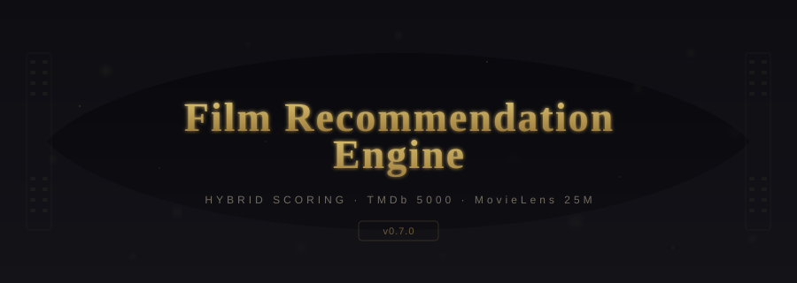
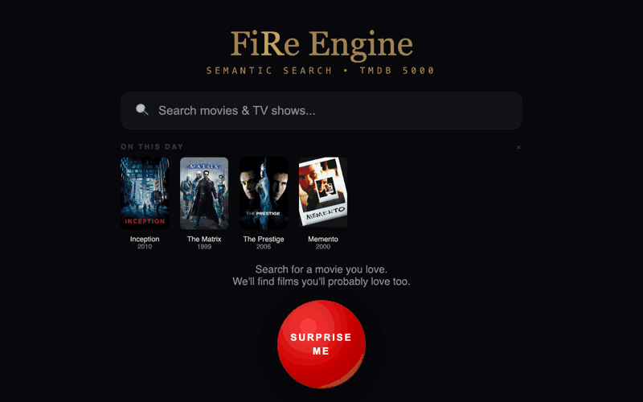
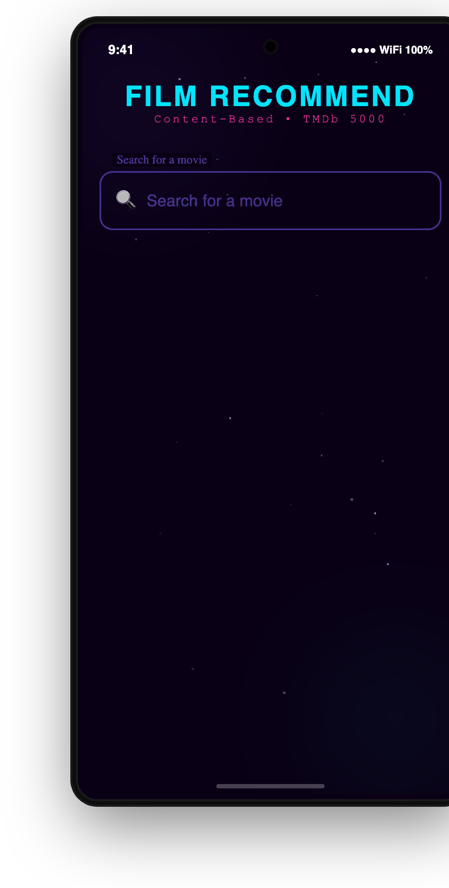
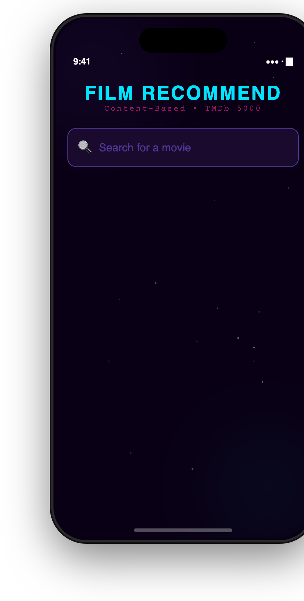
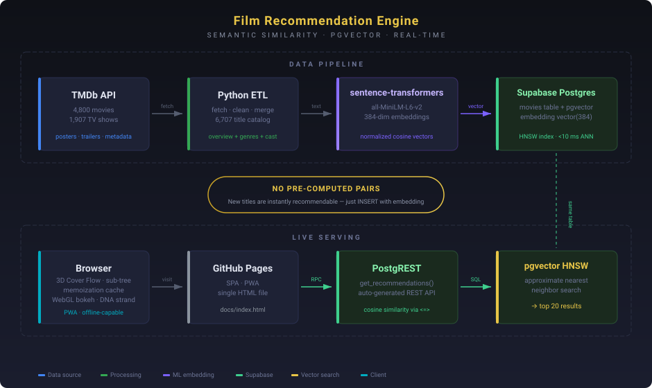
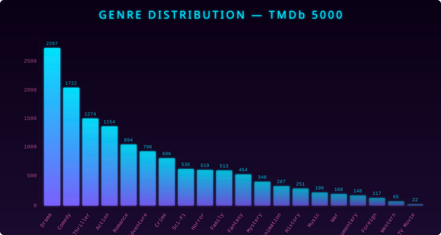

<p align="center">
  
</p>

# Film Recommendation Engine

[](https://github.com/sanjay-bhat/film_recommendation_engine/actions/workflows/ci.yml)
[](https://github.com/sanjay-bhat/film_recommendation_engine/actions/workflows/codeql.yml)
[](LICENSE)
[](https://github.com/sanjay-bhat/film_recommendation_engine/releases)
[](https://goreportcard.com/report/github.com/sanjay-bhat/film_recommendation_engine)

A semantic recommendation engine spanning **6,707 movies & TV shows**. Give it a title you love, and it returns 7 you'll probably love too — powered by sentence-transformer embeddings (all-MiniLM-L6-v2) and FAISS nearest-neighbor search across TMDb's top-rated catalog, backed by Supabase Postgres.

## Preview

<p align="center">
  <a href="https://sanjay-bhat.github.io/film_recommendation_engine/">
    
  </a>
</p>

<p align="center">
  
  &nbsp;&nbsp;&nbsp;&nbsp;
  
</p>

<p align="center">
  <a href="android/">
    
  </a>
  &nbsp;
  <a href="ios/">
    
  </a>
</p>

## Architecture

<p align="center">
  
</p>

## How It Works

Four-way retrieval gathers ~120 candidates from content, collaborative, genome, and plot sources, then a **9-signal weighted hybrid** ranks them:

| Signal | Weight | Source |
|:---|:---|:---|
| **Content Similarity** | 25% | TF-IDF features (director, cast, keywords, genres) via Euclidean distance |
| **Collaborative Filtering** | 15% | Truncated SVD (k=50) on 25M real user ratings, item-item cosine similarity |
| **Genre Jaccard** | 15% | Set intersection-over-union of genre labels |
| **Plot Embeddings** | 10% | `all-MiniLM-L6-v2` sentence transformer (384-dim → 50d via PCA) |
| **Genome Tags** | 8% | 1,128 MovieLens genome tag scores (mood, setting, era) reduced to 50d via SVD |
| **Actor Overlap** | 8% | Jaccard overlap of top-3 billed actors |
| **Director Match** | 7% | Binary signal — same director gets full weight |
| **Log Popularity** | 7% | `log(1 + votes)` normalized to [0,1] |
| **Year Proximity** | 5% | Gaussian decay (σ=15 years) around the source film's release |

Sequel deduplication via fuzzy string matching prevents franchise flooding.

## Quick Start

```bash
# Clone and set up
git clone https://github.com/sanjay-bhat/film_recommendation_engine.git
cd film_recommendation_engine
make setup          # installs Python deps + NLTK data, extracts CSVs

# Run
make run MOVIE="The Dark Knight Rises"

# Or run all language implementations side by side
make run-all MOVIE="Inception"
```

### Docker

```bash
make docker-build
make docker-run MOVIE="Inception"
```

### Terraform (local Docker)

```bash
cd terraform
cp terraform.tfvars.example terraform.tfvars
terraform init
terraform apply
```

## Genre Distribution

The dataset spans 20 genres across 4,803 films. Drama and Comedy dominate, while Western and TV Movie sit at the long tail.

<p align="center">
  
</p>

## Project Structure

```
film_recommendation_engine/
├── .github/
│   ├── ISSUE_TEMPLATE/      # Bug report & feature request forms
│   ├── workflows/           # CI + CodeQL pipelines
│   └── dependabot.yml       # Automated dependency updates
├── assets/                  # Banner, charts, visual assets
├── dataset/                 # TMDb 5000 CSVs + MovieLens 25M + pre-computed factors
├── docs/                    # GitHub Pages site
├── src/
│   ├── recommend.py         # Python implementation
│   ├── recommend.rs         # Rust implementation
│   ├── Recommend.cs         # C# implementation
│   └── recommend.go         # Go implementation
├── notebooks/
│   └── FinalFilmRecommendationEngineCode-BigData.ipynb
├── terraform/               # Local Docker deployment via Terraform
├── Dockerfile               # Containerized Python engine
├── Makefile                 # Build, run, lint, clean
└── README.md
```

## Dataset

Uses two datasets, merged into an expanded catalog of **62,000+ movies**:

**[TMDb 5000 Movie Dataset](https://www.kaggle.com/datasets/tmdb/tmdb-movie-metadata)** — content-feature backbone:
- **4,803 movies** with budget, revenue, genres, keywords, and ratings
- **4,803 credit entries** with full cast and crew data
- Keywords cleaned via NLTK stemming and WordNet synonym merging (9,474 → 2,121 unique keywords)

**[MovieLens 25M](https://grouplens.org/datasets/movielens/25m/)** — collaborative, genome & rating signals:
- **25 million ratings** from 162,000 users across 62,000 movies
- **58,945 movies** with collaborative factors (up from 4,595 with TMDb 5000 filtering)
- **13,803 movies** with genome tag factors (1,128 tags per movie — "dark hero", "plot twist", "atmospheric")
- Movies outside TMDb 5000 participate via collaborative, genome, and plot retrieval without needing content features

**Pre-computed factor files** (shipped in repo, no ML dependencies needed at runtime):
- `dataset/item_factors.csv` — collaborative SVD factors (k=50, ~27 MB)
- `dataset/genome_factors.csv` — genome tag SVD factors (k=50, ~6.5 MB)
- `dataset/plot_factors.csv` — plot sentence embedding PCA factors (d=50, ~2 MB)

## Implementations

The core recommendation algorithm is available in six languages across CLI, web, and mobile:

| Platform | Language | Directory | Notes |
|:---|:---|:---|:---|
| CLI | Python | `src/recommend.py` | Reference implementation, uses scikit-learn |
| CLI | Rust | `src/recommend.rs` | Zero-dependency, compiles to a fast CLI binary |
| CLI | C# | `src/Recommend.cs` | .NET 8, clean OOP structure |
| CLI | Go | `src/recommend.go` | Single-file, standard library only |
| Android | Kotlin | `android/` | Jetpack Compose, Material 3, fully offline |
| iOS | Swift | `ios/` | SwiftUI, async/await, fully offline |
| Web | HTML/CSS/JS | `docs/` | GitHub Pages, WebGL bokeh particles, Cover Flow UI |

## License

MIT
