<p align="center">
  
</p>

# Film Recommendation Engine

[](https://github.com/sanjay-bhat/film_recommendation_engine/actions/workflows/ci.yml)
[](https://github.com/sanjay-bhat/film_recommendation_engine/actions/workflows/codeql.yml)
[](LICENSE)
[](https://github.com/sanjay-bhat/film_recommendation_engine/releases)

A semantic recommendation engine spanning **6,707 movies & TV shows**. Give it a title you love, and it returns 20 you'll probably love too — powered by sentence-transformer embeddings (all-MiniLM-L6-v2) and pgvector HNSW search across TMDb's top-rated catalog, backed by Supabase Postgres. Double-click any recommendation to drill into a recursive sub-tree of similar titles, each level rendered in the same 3D Cover Flow carousel.

## Preview

<p align="center">
  <a href="https://sanjay-bhat.github.io/film_recommendation_engine/">
    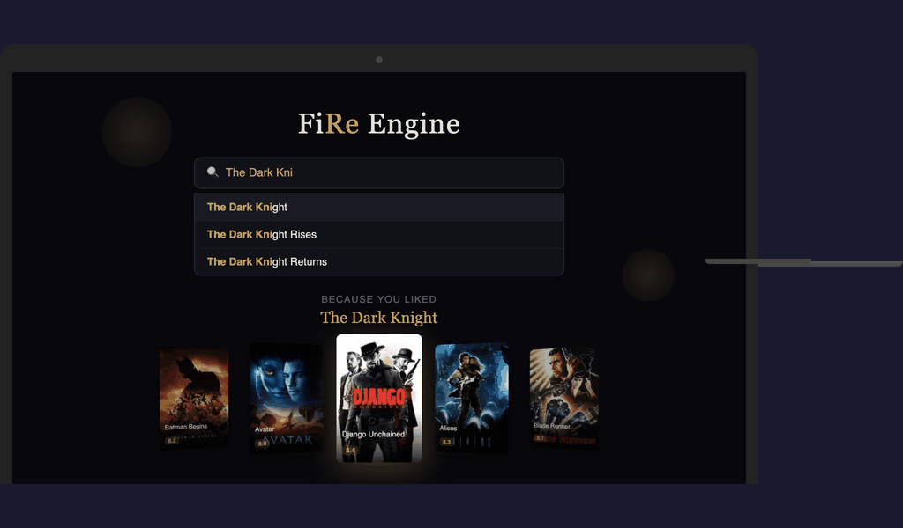
  </a>
</p>

<p align="center">
  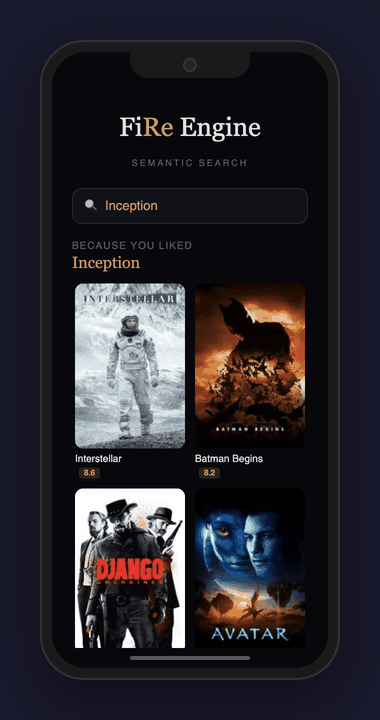
  &nbsp;&nbsp;
  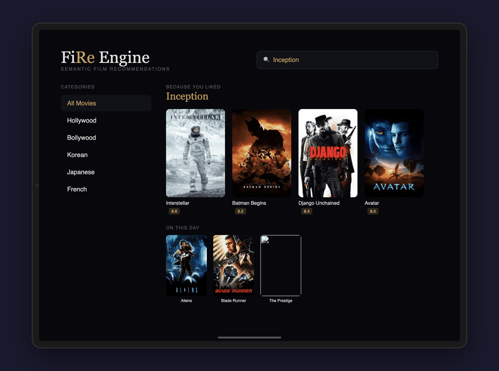
</p>

<p align="center">
  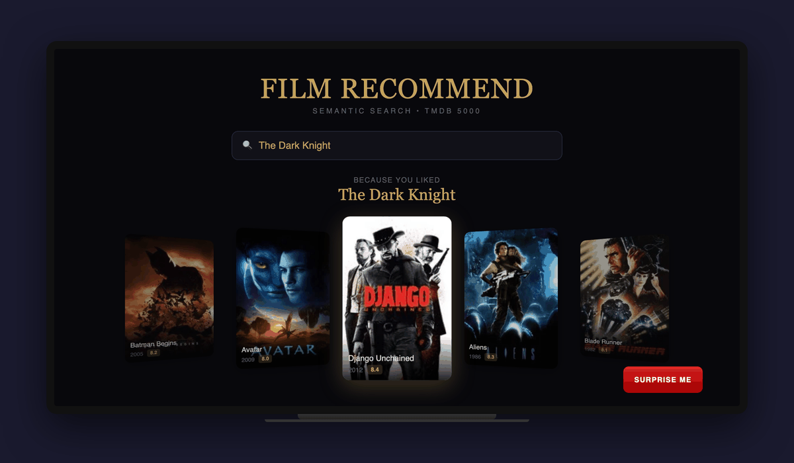
</p>

<p align="center">
  <a href="android/">
    
  </a>
  &nbsp;
  <a href="ios/">
    
  </a>
  &nbsp;
  <a href="ipad/">
    
  </a>
  &nbsp;
  <a href="tablet/">
    
  </a>
  &nbsp;
  <a href="googletv/">
    
  </a>
  &nbsp;
  <a href="appletv/">
    
  </a>
  &nbsp;
  <a href="watchos/">
    
  </a>
  &nbsp;
  <a href="wearos/">
    
  </a>
</p>

## Architecture

<p align="center">
  
</p>

## Platform Architectures

<details>
<summary><strong>Website</strong> — HTML / CSS / JavaScript</summary>
<p align="center">
  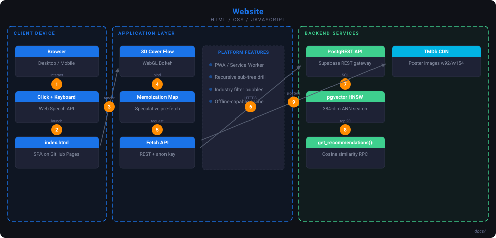
</p>
</details>

<details>
<summary><strong>iOS</strong> — Swift + SwiftUI</summary>
<p align="center">
  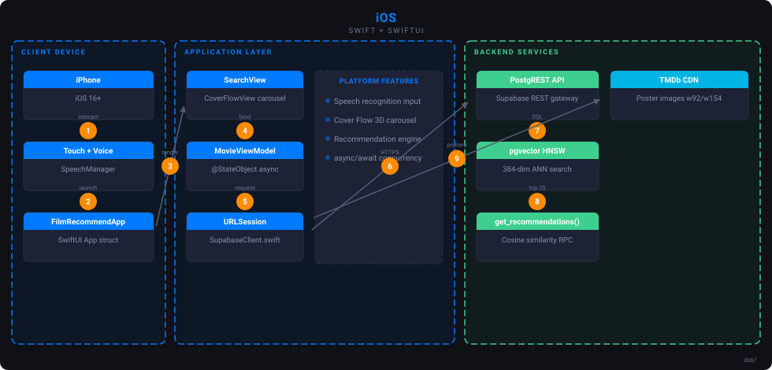
</p>
</details>

<details>
<summary><strong>iPad</strong> — Swift + SwiftUI</summary>
<p align="center">
  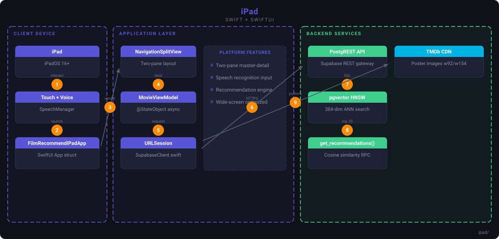
</p>
</details>

<details>
<summary><strong>Android</strong> — Kotlin + Jetpack Compose</summary>
<p align="center">
  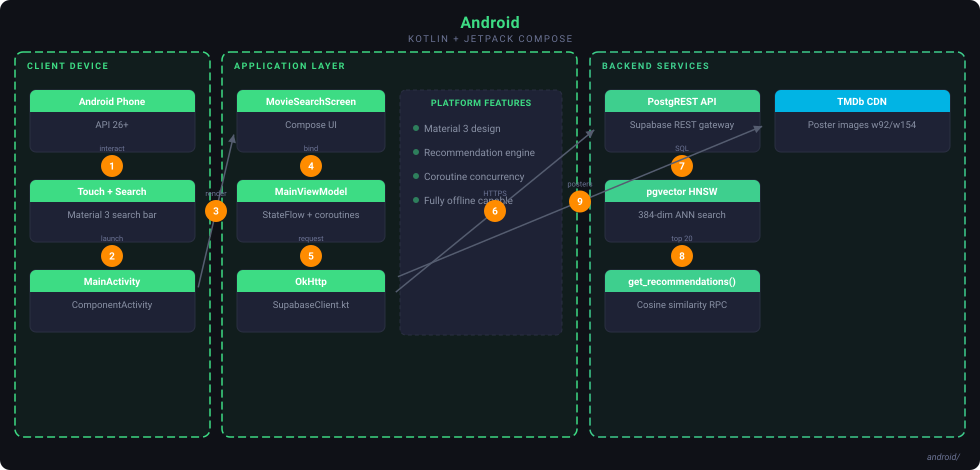
</p>
</details>

<details>
<summary><strong>Android Tablet</strong> — Kotlin + Jetpack Compose</summary>
<p align="center">
  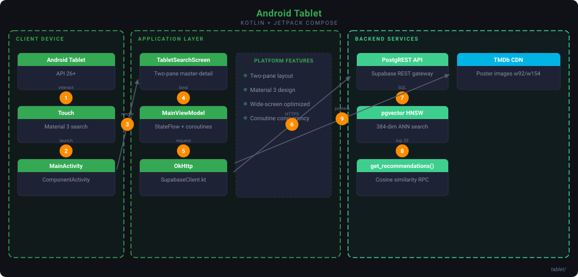
</p>
</details>

<details>
<summary><strong>Apple TV</strong> — Swift + tvOS SwiftUI</summary>
<p align="center">
  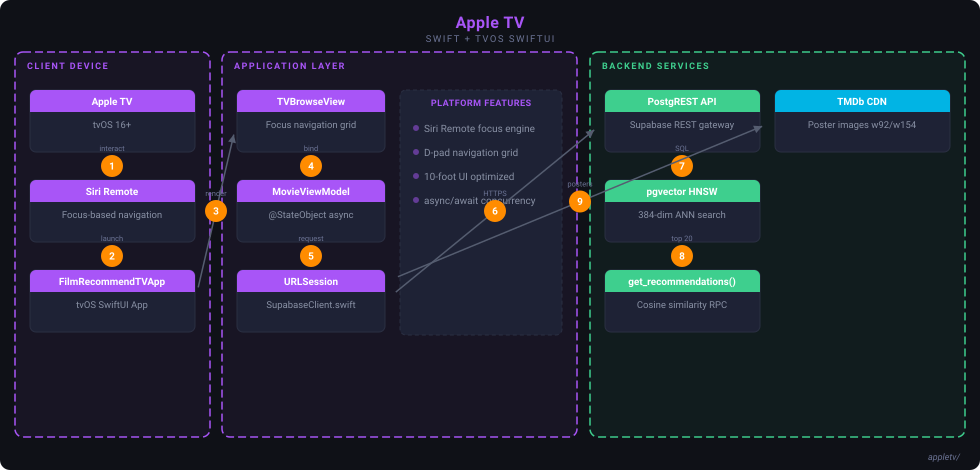
</p>
</details>

<details>
<summary><strong>Google TV</strong> — Kotlin + Compose for TV</summary>
<p align="center">
  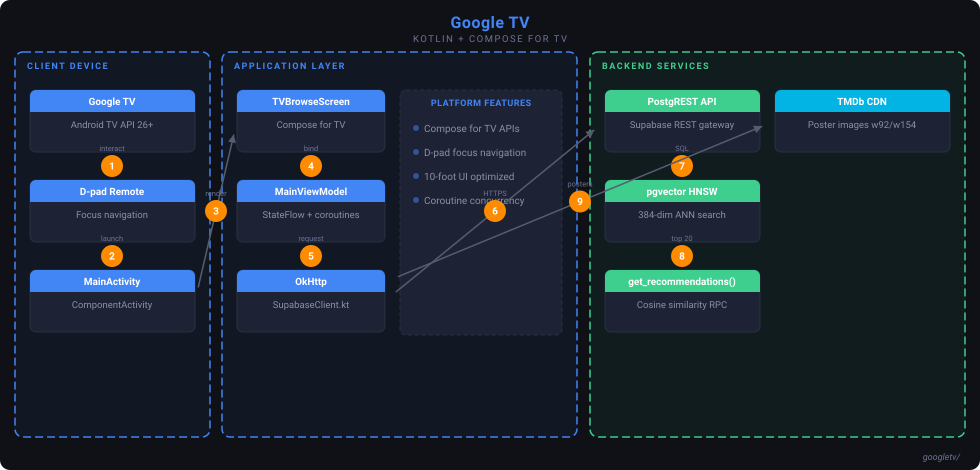
</p>
</details>

<details>
<summary><strong>watchOS</strong> — Swift + SwiftUI</summary>
<p align="center">
  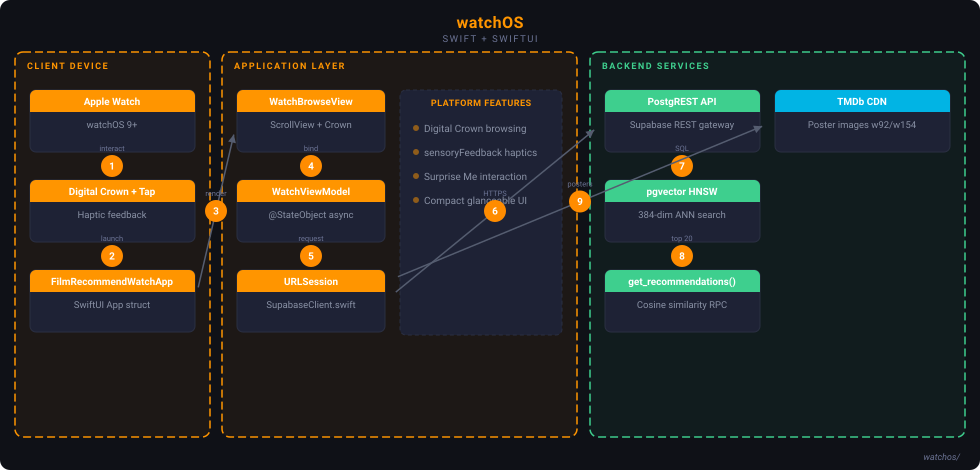
</p>
</details>

<details>
<summary><strong>Wear OS</strong> — Kotlin + Compose for Wear</summary>
<p align="center">
  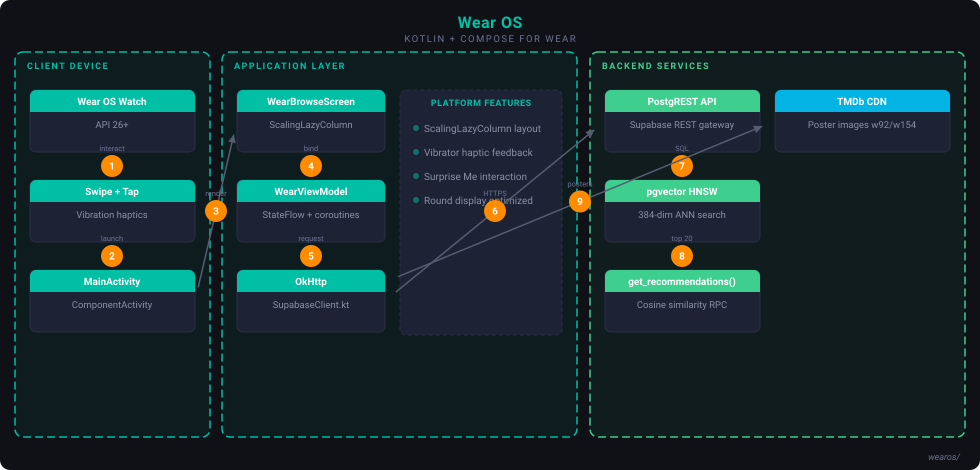
</p>
</details>

## How It Works

Every title in the catalog is encoded into a 384-dimensional vector using **all-MiniLM-L6-v2**, a sentence-transformer model that captures semantic meaning from plot overviews, genres, cast, and keywords. These vectors are indexed with **pgvector HNSW** for sub-10ms approximate nearest-neighbor lookups.

| Step | What happens |
|:---|:---|
| **1. Embed** | Each title's metadata (overview, genres, cast, keywords) is encoded into a 384-dim vector |
| **2. Index** | pgvector builds an HNSW index over all 6,707 vectors in Supabase Postgres |
| **3. Search** | Given a title, pgvector finds the 20 nearest neighbors by cosine similarity |
| **4. Serve** | Recommendations are computed at query time via PostgREST RPC — no pre-computed pairs |
| **5. Cache** | In-memory memoization Map + speculative pre-fetch for instant sub-level loading |

The frontend is a single-page app on GitHub Pages with a **3D Cover Flow** carousel, **recursive sub-tree recommendations** (double-click to drill deeper), **industry filter bubbles**, **WebGL bokeh** particles, and full **PWA** offline support.

## Quick Start

### Try it live

👉 **[sanjay-bhat.github.io/film_recommendation_engine](https://sanjay-bhat.github.io/film_recommendation_engine/)**

### Run locally

```bash
git clone https://github.com/sanjay-bhat/film_recommendation_engine.git
cd film_recommendation_engine
python3 -m http.server 8765 -d docs
# Open http://localhost:8765
```

### Rebuild recommendations from scratch

```bash
pip install -r requirements.txt

# Fetch catalog from TMDb API
python scripts/fetch_tmdb_catalog.py --api-key YOUR_TMDB_KEY
python scripts/fetch_tv_shows.py --api-key YOUR_TMDB_KEY

# Generate embeddings + recommendations
python scripts/generate_recommendations.py

# Migrate to Supabase
python scripts/migrate_combined.py --url https://YOUR_PROJECT.supabase.co --key YOUR_SERVICE_ROLE_KEY
```

## Genre Distribution

The catalog spans 20+ genres across 4,800 movies and 1,907 TV shows. Drama and Comedy dominate, while TV-specific genres like Sci-Fi & Fantasy and Action & Adventure (pink bars) reflect TMDb's separate taxonomy for television.

<p align="center">
  
</p>

## Dataset

**6,707 titles** sourced from [TMDb](https://www.themoviedb.org/) — the top-rated movies and TV shows by vote count. Each title carries its overview, genres, cast, keywords, poster, trailer, release date, and original language. Recommendations are computed at query time using pgvector HNSW nearest-neighbor search over 384-dimensional sentence-transformer embeddings stored in Supabase Postgres.

## Implementations

| Platform | Language | Directory | Notes |
|:---|:---|:---|:---|
| Web | HTML/CSS/JS | `docs/` | GitHub Pages, WebGL bokeh, 3D Cover Flow, recursive sub-tree, PWA |
| Android | Kotlin | `android/` | Jetpack Compose, Material 3, fully offline |
| iOS | Swift | `ios/` | SwiftUI, async/await, fully offline |
| iPad | Swift | `ipad/` | SwiftUI, NavigationSplitView two-pane layout |
| Android Tablet | Kotlin | `tablet/` | Jetpack Compose, two-pane master-detail layout |
| Google TV | Kotlin | `googletv/` | Compose for TV, D-pad/Siri Remote focus navigation |
| Apple TV | Swift | `appletv/` | tvOS SwiftUI, focus-based Siri Remote navigation |
| watchOS | Swift | `watchos/` | SwiftUI, Digital Crown browsing, Surprise Me haptics |
| Wear OS | Kotlin | `wearos/` | Jetpack Compose, swipe navigation, Surprise Me haptics |
| CLI | Python | `src/recommend.py` | Reference implementation |
| CLI | Rust | `src/recommend.rs` | Zero-dependency, fast CLI binary |
| CLI | C# | `src/Recommend.cs` | .NET 8, clean OOP structure |
| CLI | Go | `src/recommend.go` | Single-file, standard library only |

## License

MIT
